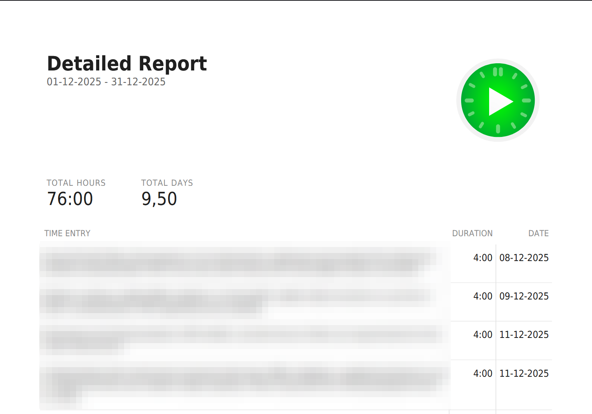

# kimai-toggl-report-template

A [Kimai](https://www.kimai.org/) template modeled after [Toggl's](https://toggl.com/) Detailed Report.

## Preview

## Installation

To install this template in Kimai:

1. Merge the `export/` folder from this repository into your Kimai installation. 
2. Place it in: `<kimai-root>/var/export/...`
3. Restart Kimai or clear the cache to ensure the new template is recognized.

